<p align="center">
  
</p>

# Smash Pairing

<p align="center"><em>Random 2v2 team generator for <strong>Super Smash Bros Ultimate</strong>. Built for friendly sets between mates. Drops a 30-minute bracket-setup ritual to under five.</em></p>

<p align="center">
  <a href="https://p-iggsray.github.io/Smash-Pairing/">
    
  </a>
</p>

A few of us run friendly Smash sets every now and then. Before this, team picking was just kind of guessing where things went, and somebody always ended up paired badly. The fix is two columns of names in (skilled / less skilled), balanced teams out, named and pasted into Challonge before the first match starts.

No accounts. No login. Installable. Works offline.

---

## How to Play

Two screens — Home and Results — plus a hamburger menu. That's the whole app.

● **Stock 1 — Roster.** On the Home screen, add players into two columns: **Experienced** and **Inexperienced.** Tap a name to rename. Tap × to remove. Got the list typed out somewhere already? The bulk-add takes a whole batch from a paste.

● **Stock 2 — Mode.** Hamburger top-right. Pick **Full 2v2** (one exp + one inex per team — default) or **Split 2v2** (same-skill teams).

● **Stock 3 — Generate.** Big button at the bottom. Confetti. Numbered team cards on the Results screen.

● **Stock 4 — Names. Or skip.** Tap the dashed line above any team to give it a name. Skip it and you get Team 01, Team 02, Team 03.

● **Stock 5 — Export.** Hit **Export for Challonge.** Bottom sheet opens with one team per line. Copy. Paste into Challonge's bracket builder. Bracket's seeded.

**GAME!**

### Mode select

```
╔══════════════════════════╦══════════════════════════╗
║         FULL 2v2         ║        SPLIT 2v2         ║
║                          ║                          ║
║      exp  +  inex        ║      exp  +  exp         ║
║       (every team)       ║      inex +  inex        ║
║                          ║                          ║
║   Mixed skill on every   ║   Same-skill pairs.      ║
║   team. No team gets     ║   For when you want a    ║
║   stacked. Default.      ║   tier-vs-tier bracket.  ║
╚══════════════════════════╩══════════════════════════╝
```

Full 2v2 is the reason the app exists. Stops you from putting two strong players on one team and the two weaker ones on another. Split 2v2 is there for when you want the opposite.

### Set Teams

The **Set Teams** panel on the Home screen locks specific pairs that always play together. They get a card on Results just like the random pairs, just without the swap behavior. Useful when two people in the group always duo, or when a new guy is shadowing someone who knows the matchups.

---

## Move List

### Standard Moves

● Skill-balanced random pairing in Full 2v2 — never two experienced or two inexperienced on the same team
● Split 2v2 mode for tiered brackets
● **Set Teams** to lock specific pairs out of the shuffle
● Late arrivals — add a player after generating, hit **Pair Waiting**, they form the next team
● Player swap — tap two players on Results to swap them between teams
● Custom team names that flow straight into the Challonge export
● **Presets** — save and reload named rosters so a recurring crew doesn't get re-entered every time
● Two-tap **Reset Teams** wipes pairings without touching the rosters
● Auto-save to `localStorage` — force-quit the app, your lists are still there

### Special Moves

● Splash screen with a custom Kirby-shaped icon
● Confetti on Generate (respects `prefers-reduced-motion`)
● Pulse animations on the Generate button, editable team-name underlines, and the swap-selected player
● Per-column accents — exp blue, inex green, set gold — carried through buttons, chips, and member dots
● Stencil team numbers on each Results card
● Inline name editing — tap any name to rename in place

### Final Smash

● Installable as a PWA — adds to the iPhone Home Screen, runs full-bleed
● Offline once installed
● Auto-updates on every launch via the service worker. No App Store, no manual cache-clear
● Built for iPhone — safe-area insets for the Dynamic Island and home indicator, no iOS auto-zoom on text inputs, no horizontal scroll on small phones

---

## Add to Roster

Install on iPhone:

1. Open the **[live demo](https://p-iggsray.github.io/Smash-Pairing/)** in **Safari.** iOS doesn't let Chrome or Firefox install PWAs.
2. Tap the **Share** button.
3. Choose **Add to Home Screen.**
4. Icon shows up labeled **Smash Pairing.**

Open it from the Home Screen and it runs like a native app — no browser chrome, no URL bar.

---

## Training Mode

A handful of static files. No build step. Any static server works.

```bash
python3 -m http.server 8000
# or
npx serve .
```

Then `http://localhost:8000`.

Folder layout: `index.html`, `service-worker.js`, and `manifest.webmanifest` at the root. Everything else (JS, CSS, SVG) lives in `assets/`.

---

## Specs

- Plain HTML, CSS, JavaScript. No frameworks, no bundler, no dependencies.
- State in `localStorage`. Auto-saves on every change.
- Service worker — network-first with cache fallback. New deploys reach installed PWAs within seconds.
- Hosted on **GitHub Pages.**

---

## Why this exists

A few of us play Smash Ultimate every now and then. We needed a way to actually balance the teams instead of stacking all the skilled players on one side. Doing it by hand took thirty minutes and someone always got the short end.

This brought it under five. If your group runs the same kind of thing, it's all yours.
